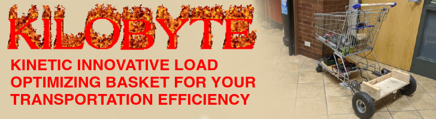

# KILOBYTE
KILOBYTE (Kinetic Inovative Load Optimizing Basket for Your Transportation Efficiency) is a motorized shopping cart made from scrap parts left over from the KUDOS project.

# Timeline
- Revision 3
  - Battery/Power
    - [x] Implement new LIFePo4 Battery
      - [x] Attatch Anderson Powerpole connector
      - [x] Design and implement new mounting brackets
      - [ ] Test battery lifetime
    - [x] Add 5V regulator to power display unit and control unit
  - Display Unit
    - [x] Implement new display unit housing
      - [x] Create new Arduino shield for power and all IO
    - [ ] Upgrade and finalize firmware
      - [ ] Show battery voltage and percentage on screen
      - [ ] Calculate RPM and velocity from hall effect sensor
      - [ ] Implement master software shutoff switch
      - [ ] Make UI more user friendly
      - [ ] Add safeguards for when communication to control unit is lost
      - [x] Implement UI LEDs
      - [x] 
  - Control Unit
    - [ ] Implement acceleration smoothing to reduce initial current and QOL
    - [ ] Ensure that if any error occurs, motors always default to a safe state
  - Electronics
    - [ ] Finalize mounting off all electronics and batteries
      - [ ] Test mounting for strength and neatness
    - [x] Ensure all electronics are properly fused
    - [ ] Ground entire chassis?
    - [ ] Neatly route power+communication wiring to display unit
      - [ ] Design custom cable harness/mounting atachments?
    - [ ] Cut and paint the board electronics will be mounted on
  - Safety
    - [ ] Detect human presence on chariot, do not allow operation if not detector
    - [ ] Add configurable speed limiter
    - [ ] Add a hardware battery disconnect
    - [ ] Test all automatic fuses
  - Cosmetics
    - [x] Implement CSH colors in all parts where possible
    - [ ] Add custom accents and eye candy/decorations
    - [ ] Decide on a primary color (CSH colors are accents)
      - Should we replace the original blue plastic parts of the cart with custom 3d printed alternatives?

