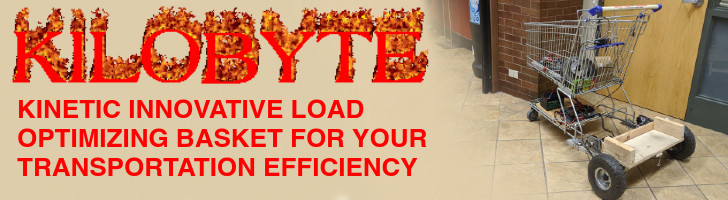
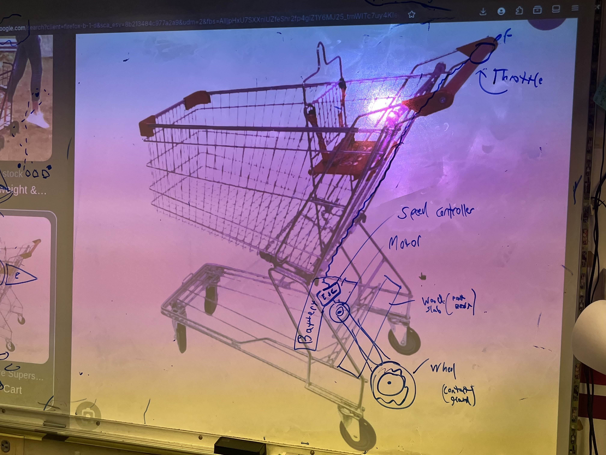
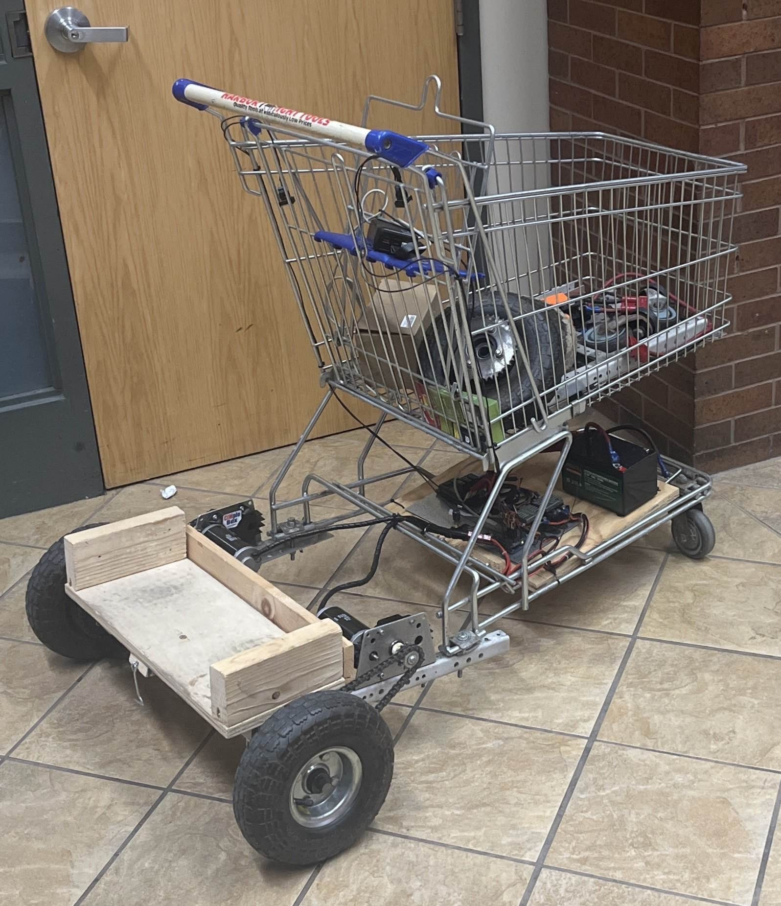
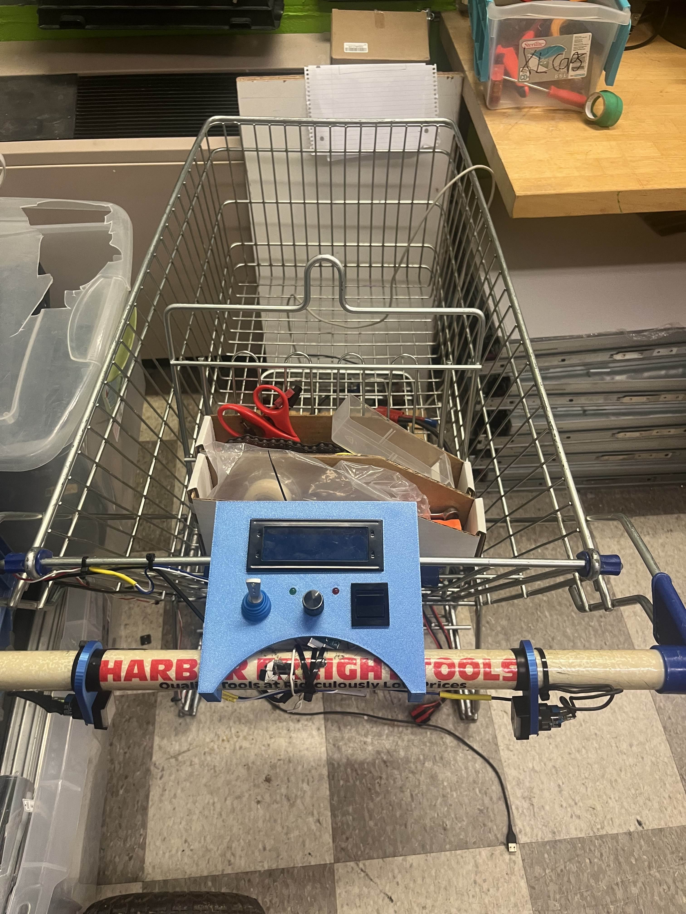

# KILOBYTE
KILOBYTE (Kinetic Inovative Load Optimizing Basket for Your Transportation Efficiency) is a motorized shopping cart made from scrap parts left over from the KUDOS project.

# Timeline

The original blueprints for Kilobyte, at the time simply named "Motorized Shopping Cart", were much simpler than current designs. The cart would include one wheel at the back, with one central throttle. This design failed to take into account steering and stability. 

 
 

The first prototype was completed overnight for CSH's Major-projectathon by Riley Barshak and Tyler Severino. This design reflects many fundamental changes to our plans for Kilobyte. We decided to change from a one wheel design to a two wheel design. Our design features two rear wheels, each with their own motor and throttle. This allows for steering, greater stability, and more power overall. In this prototype, throttle buttons were loosley held onto the handle, and the potentiometer was mounted at the bottom, used to control velocity. Velocity control (speed & direction) were based on potentiometer values 0-255 where, 0-127 sets reverse speeds, 128 is idle, and 129-255 set forward speeds. 

 
 

The next iteration of Kilobyte introduces many structural and user interface improvements. The most prominent new feature is the control panel. The control panel includes many useful features and status displays. The right-most button is on/off (with a status LED), the left-most button is forward/reverse (with a status LED), and the potentiometer in the middle controls speed (not velocity anymore). Additionally, there is a digital display to show battery percentage/voltage, throttle percentage, forward/reverse status, and controller connectivity status (for plans to make Kilobyte controllable with an xbox controller). Also coming with this version, electronics were reorganized, with many being placed within the control panel, and structural improvements were made to the bottom. 

 
 
 
 

# In Progress (Revision 3)
- Battery/Power
  - [x] Implement new LIFePo4 Battery
    - [x] Attatch Anderson Powerpole connector
    - [x] Design and implement new mounting brackets
    - [ ] Test battery lifetime
	- [ ] Test all automatic fuses
  - [x] Add 5V regulator to power display unit and control unit
- Display Unit
  - [x] Implement new display unit housing
    - [x] Create new Arduino shield for power and all IO
  - [ ] Upgrade & enhance firmware
    - [ ] Show battery voltage and percentage on screen
    - [x] Make UI more user friendly
    - [x] Add safeguards for when communication to control unit is lost
    - [x] Implement UI LEDs
- Control Unit
  - [ ] Implement acceleration smoothing to reduce initial current and QOL
  - [x] Ensure that if any error occurs, motors always default to a safe state
- Electronics
  - [x] Finalize mounting of all electronics and batteries
    - [x] Test mounting for strength and neatness
  - [x] Ensure all electronics are properly fused
  - [x] Neatly route power+communication wiring to display unit
    - [x] Design custom cable harness/mounting atachments
  - [x] Cut a wooden board to mount electronics on
    - [x] Design battery mounting solution
- Cosmetics
  - [x] Implement CSH colors in all 3d-printed parts

# Next Up (Revision 4)
- Display Unit 
  - [ ] Calculate RPM and velocity from hall effect sensor
- Control Panel 
  - [ ] Add routing through control panel
  - [ ] Add routing into handle
  - [ ] Connect buttons directly to control panel
- Safety
  - [ ] Detect human presence on chariot, do not allow operation if not detector
  - [ ] Add configurable speed limiter
  - [x] Add a hardware battery disconnect
  - [ ] Grip tape / bed liner for chariot
- Cosmetics
  - [ ] clean and clear coat aluminum 
  - [ ] Paint 
  - [ ] Head Lights
- Drive Train
  - [ ] Chain lube
- Control Unit
  - [ ] Xbox controller 
  - [ ] Demo mode